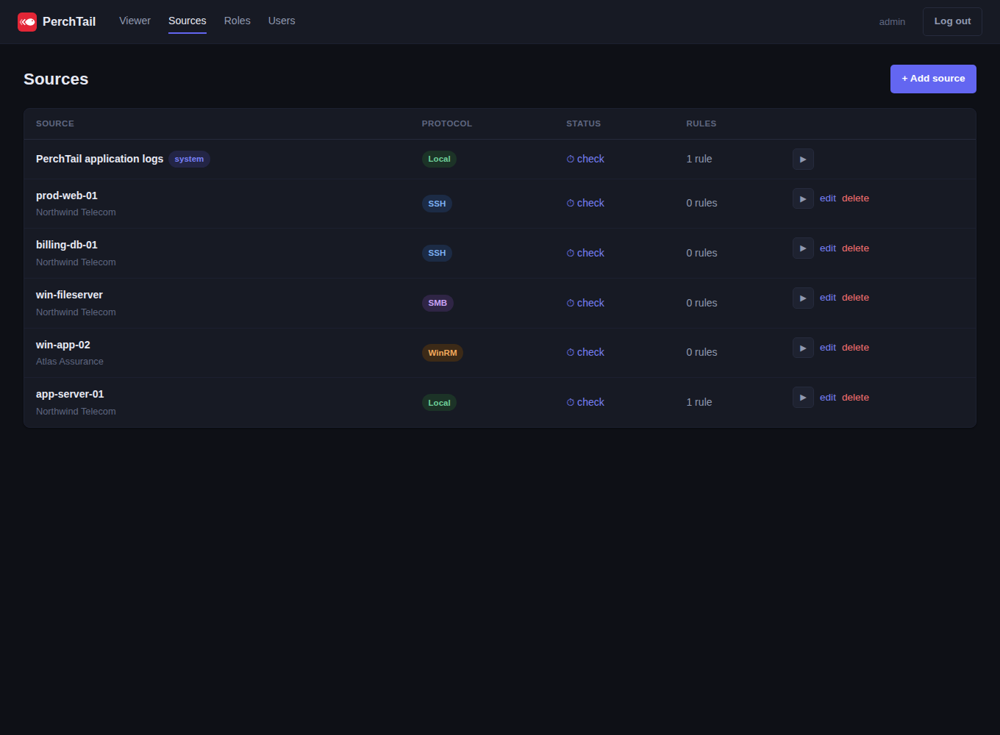
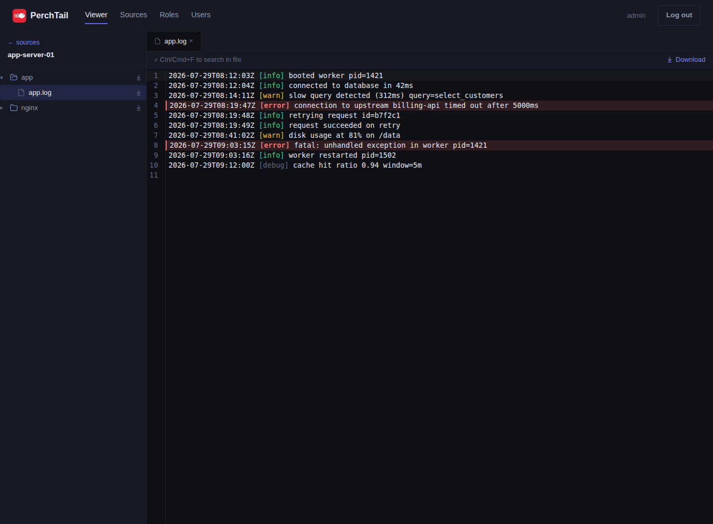
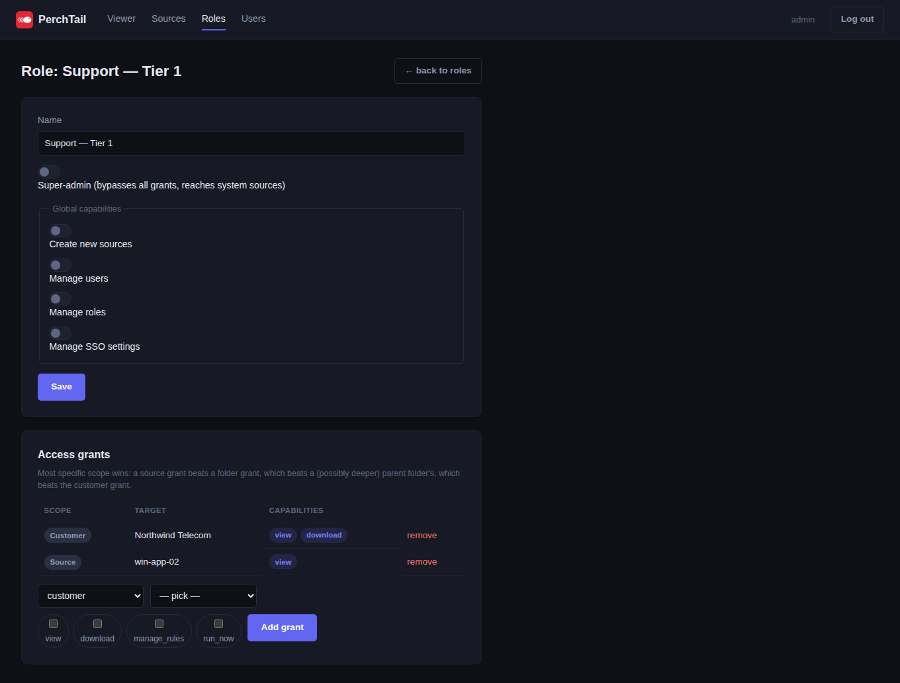

<p align="center">
  
</p>

<h1 align="center">PerchTail</h1>

> Live, rule-scoped log browsing across Linux and Windows servers — no agents,
> nothing mirrored, nothing left behind.

[](LICENSE)
[](#status)
[](https://github.com/quaresma870/perchtail/actions/workflows/ci.yml)

**Contents:** [Status](#status) · [What it is](#what-it-is) ·
[Why not just use X](#why-not-just-use-x) ·
[Feature comparison](#feature-comparison) · [Screenshots](#screenshots) ·
[Quick start](#quick-start) · [Documentation](#documentation) ·
[License](#license)

## Status

🟢 **Phase 1 (MVP), Phase 1b (SSO), Phase 2 (push-agent), and Phase 3's
full-text search are all complete** (see [ROADMAP.md](ROADMAP.md) for the
full phase breakdown). Agentless SSH/SFTP, SMB, and WinRM browsing, a Go
push-agent for hosts that can't be reached inbound, ephemeral fetch
(nothing mirrored), rule-scoped RBAC, OIDC single sign-on (local accounts
still work alongside it), and opt-in full-text search over indexed
sources all work end-to-end. The Viewer's home page is a two-column
"recent connections / all connections" dashboard with a search box
(folder/customer/host), and deployment-wide feature toggles now live
under Settings → System. Still pre-1.0: SAML isn't built (OIDC covers
Azure AD/Entra ID, Okta, Google Workspace, Keycloak/Authentik, so it's
only getting built if a real need shows up), alerting, IdP
group-claim-to-role auto-mapping, and the admin-only audit log viewer
aren't built yet, and it hasn't seen production traffic beyond the
maintainer's own use. See [CHANGELOG.md](CHANGELOG.md) for what's
actually shipped versus planned.

## What it is

PerchTail gives support and ops engineers one place to browse, open, and download
log files live from a mix of Linux and Windows servers — without installing
anything on those servers, and without permanently copying their content anywhere.

You configure **sources** (a host and how to reach it — SSH/SFTP, SMB, or WinRM),
attach **rules** (which files and folders are visible, glob or regex, evaluated in
order), and PerchTail lists and fetches matching files live, opened in a
Notepad++/VS-Code-style viewer and downloadable as single files or zipped folders.
Nothing is proactively mirrored or cached across views — every open is a fresh
fetch, because the logs behind it are still being written.

RBAC is built in from day one: access is scoped per customer/environment, not just
per user, so a support engineer working one account can't accidentally browse
another's production logs.

## Why not just use X

- **Graylog / OpenSearch / Wazuh** — built around search over an ingested,
  indexed copy of your data. Great if you want that; overkill if you just want to
  look at what's actually on the box right now, and archiving-to-disk is often
  gated behind enterprise tiers.
- **rclone / rsync** — excellent at rule-based selective access to remote files,
  but no viewer, and built to copy rather than to browse-and-discard.
- **Filebrowser / Filestash / code-server** — good viewers, but no rule-scoped,
  cross-protocol, multi-source access with RBAC on top.

PerchTail is the missing middle: rule-scoped live access plus a real viewer, with
nothing sitting around afterward for someone to leak or for disk to fill up with.

## Feature comparison

| | PerchTail | Graylog | Wazuh | rclone + a file browser | Loki |
|---|---|---|---|---|---|
| Live view, nothing stored | ✅ | ❌ ingests a copy | ❌ ingests a copy | ❌ mirrors to disk | ❌ ingests a copy |
| Agentless Linux + Windows | ✅ SSH/SFTP, SMB, WinRM | needs Beats/NXLog agents | needs an agent | rclone remotes | needs Promtail agent |
| Customer/environment-scoped RBAC | ✅ built in | limited / enterprise | role-based, not scoped this way | ❌ | limited |
| SSO | ✅ OIDC (SAML 🚧 if needed) | enterprise tier | ✅ | ❌ | via Grafana |
| Code-editor-style viewer | ✅ CodeMirror | search UI, not a file viewer | search UI | depends which browser | Grafana Explore |
| Setup | single docker-compose | multi-service | multi-service | multiple tools glued together | multi-service |

This table reflects the design as of this writing and each project evolves —
verify anything that matters to your decision against current docs.

## Screenshots

Sources, grouped by customer, with a protocol badge and connection status per row:



The viewer: a lazy-loaded folder tree feeding a CodeMirror pane, with `[error]`/`[warn]`
tokens colored and error lines tinted:



A role's access grants — most-specific-scope-wins, resolved from customer down to a
single source:



## Quick start

```bash
git clone https://github.com/quaresma870/perchtail.git
cd perchtail
cp .env.example .env
```

Edit `.env` and set a real `CREDENTIAL_ENCRYPTION_KEY` — this encrypts SSH/SMB/
WinRM credentials at rest, so don't ship the placeholder:

```bash
python3 -c "import secrets; print(secrets.token_urlsafe(32))"
```

Then bring it up:

```bash
docker compose up -d
```

On first startup (only when the database has zero users), PerchTail creates a
break-glass super-admin account with a randomly generated password and prints
it once to the container logs — grab it before it scrolls away:

```bash
docker compose logs perchtail | grep initial_super_admin
```

Open `http://localhost:8080`, sign in with that username/password (`admin` by
default — override with `INITIAL_ADMIN_USERNAME` in `.env` before first
startup), and you'll be forced to set your own password immediately. From
there: **Settings → Sources → + Add source** to point PerchTail at a server
(see [docs/source-setup.md](docs/source-setup.md) for what the source side
needs configured first), attach a rule so something is actually visible (a
source with zero rules shows nothing, by design), and open **Viewer** to
browse it.

State (the SQLite database, rotated application logs, and the ephemeral
scratch cache) lives in the `perchtail-data` Docker volume, so it survives
`docker compose down`/`up` — only `docker compose down -v` discards it.

## Documentation

- [CLAUDE.md](CLAUDE.md) — full design/architecture reference and build plan
- [ROADMAP.md](ROADMAP.md) — phased milestones and what's next
- [docs/source-setup.md](docs/source-setup.md) — how to prepare a Linux or
  Windows server so PerchTail can reach it over SSH/SFTP, SMB, or WinRM
- [docs/monitoring.md](docs/monitoring.md) — the detailed health endpoint for
  external monitoring (Zabbix, Prometheus), and how to generate its token
- [docs/credential-key-rotation.md](docs/credential-key-rotation.md) — how to
  rotate `CREDENTIAL_ENCRYPTION_KEY` without losing access to already-
  encrypted credentials
- [CONTRIBUTING.md](CONTRIBUTING.md) — how to get a dev environment running and
  submit changes
- [SECURITY.md](SECURITY.md) — how to report a vulnerability
- [CHANGELOG.md](CHANGELOG.md) — what's shipped, release by release

## License

MIT — see [LICENSE](LICENSE).
